<div align="center">

# 🎨 OMM Photo Acrylic Diptych

**将一张照片转化为「真实摄影上半区 + 纸本丙烯插画下半区」的 3:4 竖版双分区艺术海报**

[](https://github.com/juanshejun-ui/omm-photo-acrylic-diptych)
[](./LICENSE.md)
[](#)

</div>

---

## ⚠️ 声明

> **Free for personal, educational, research and non-commercial use.**  
> Commercial use, resale and commercial redistribution require prior written authorization.  
> 如果这个 Skill 帮助了你的创作，欢迎注明来源并标记 **@juanshejun-ui**。

<details>
<summary>💬 作者的话</summary>

这套 Skill 来自对极简插画、纸张媒介、丙烯色块和摄影叙事关系的持续测试。欢迎用于个人创作、学习、研究与非商业分享，也欢迎基于它发展自己的审美表达；但请不要未经授权直接出售、包装成付费产品，或用于客户项目及其他商业场景。

</details>

---

## 📖 关于本项目

这是一个 **Codex Skill**，用于把一张或多张照片分别制作成安静、诗意、克制的 3:4 竖版艺术海报。

- ✅ 上半部分严格保留原始摄影内容与真实质感
- ✅ 下半部分从照片提炼主体、动作、轮廓、空间和叙事关系
- ✅ 使用粗糙纸张、纤细手绘线条和少量丙烯平涂色块
- ✅ 通过确定性拼接确保最终画布为严格 3:4、上下严格 50% / 50%
- ❌ 不是滤镜、照片描摹、自动线稿或写实重画

---

## 🖼️ 风格参考

> **作品版权声明：** 以下 12 张原始摄影与双分区海报作品均由 **@juanshejun-ui** 创作并持有版权。  
> 未经作者书面许可，请勿单独转载、裁剪、修改、二次售卖、用于商业展示，或收录为模型训练素材。

<p align="center">
  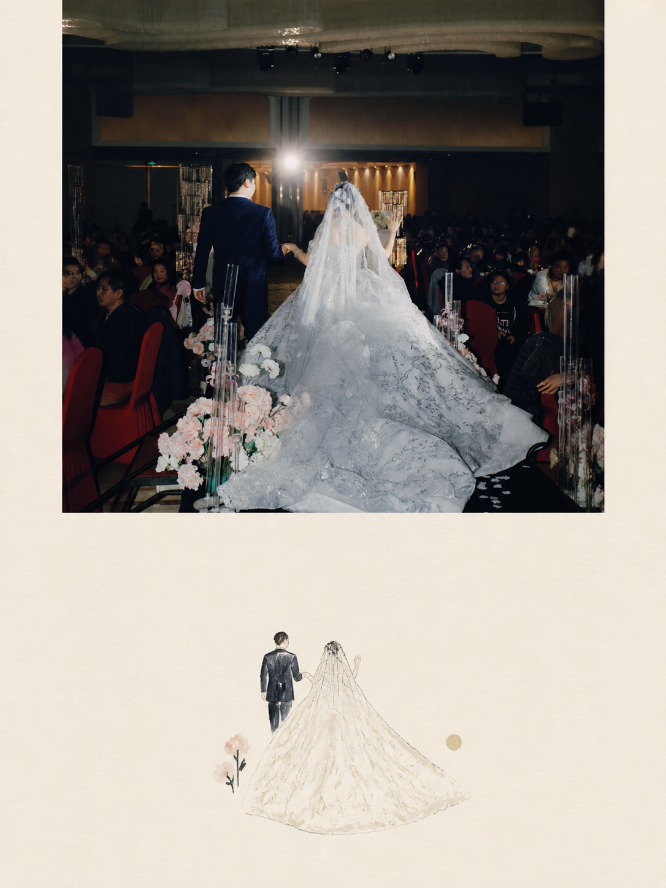
  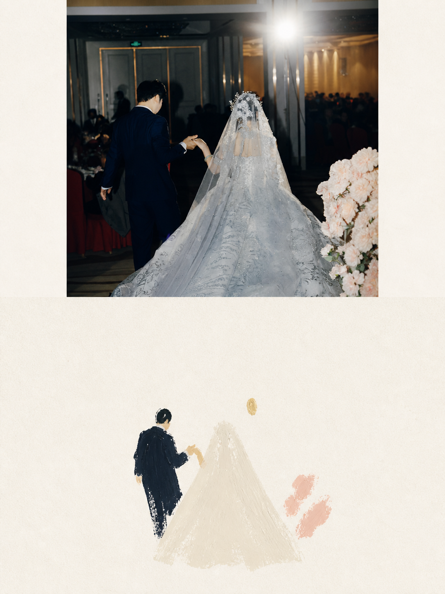
  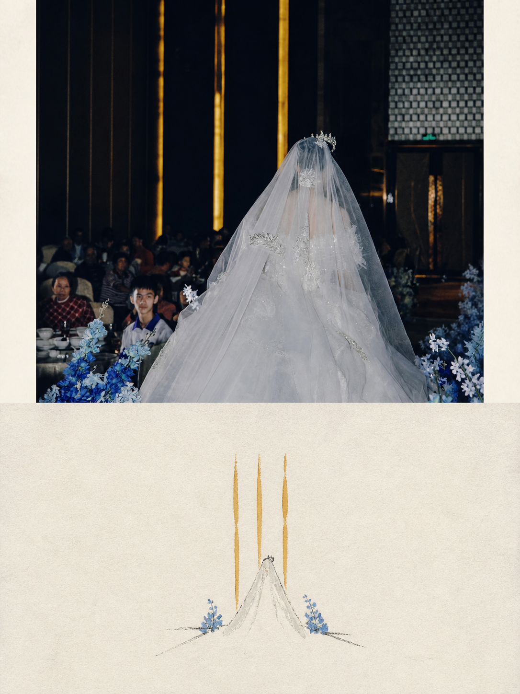
  <br><br>
  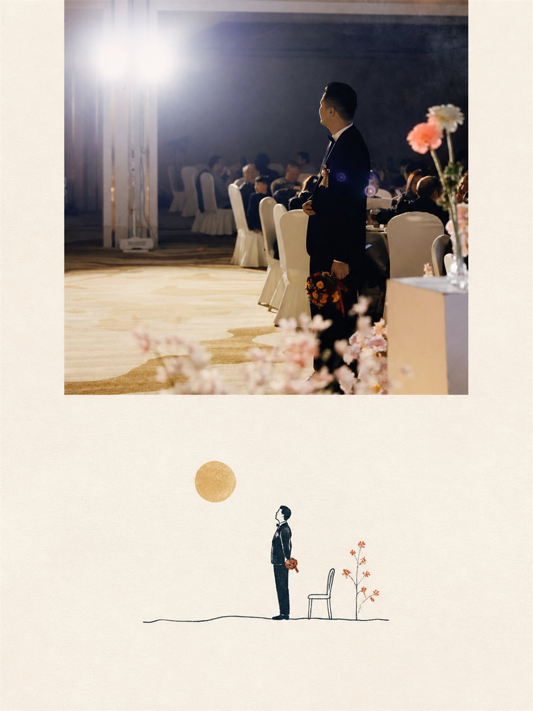
  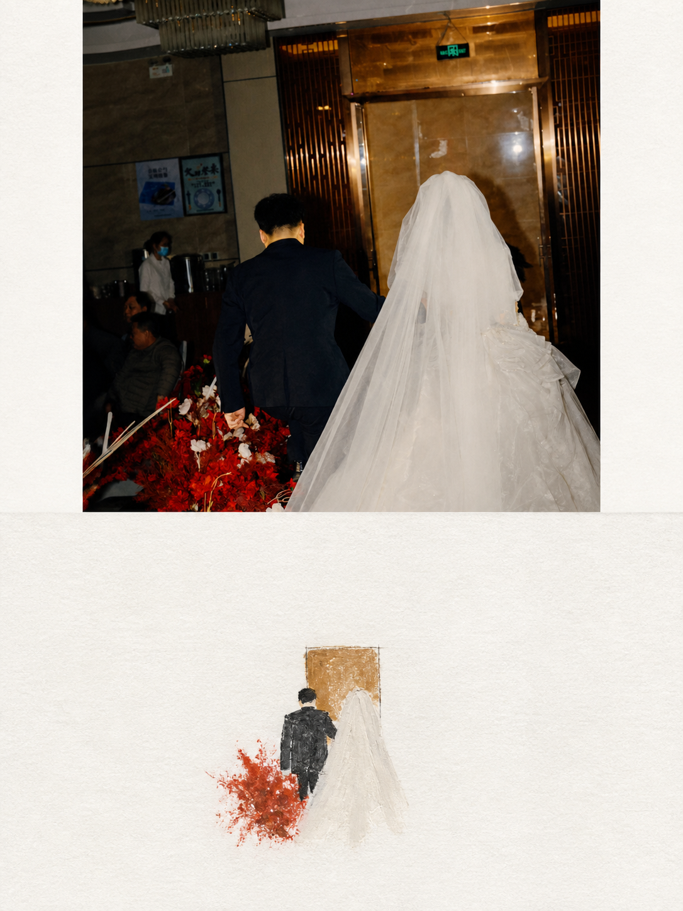
  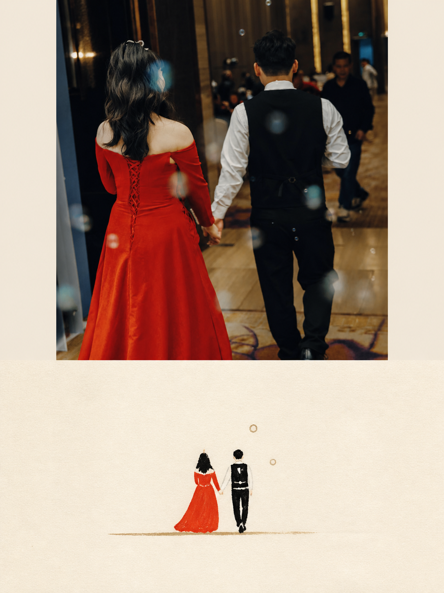
  <br><br>
  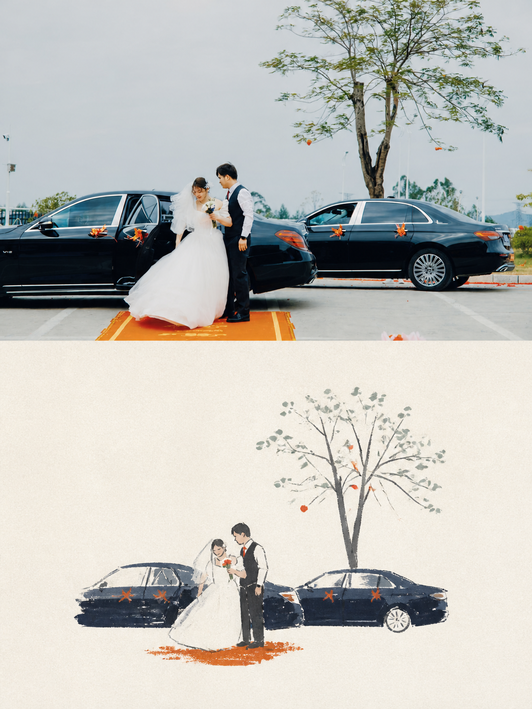
  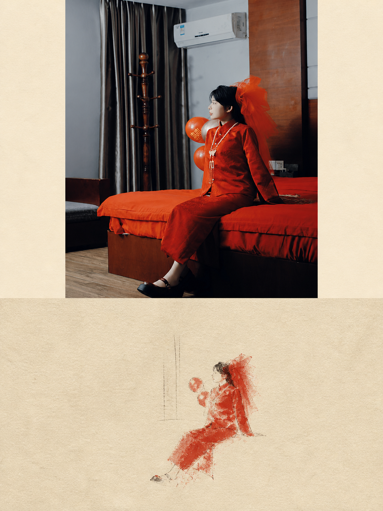
  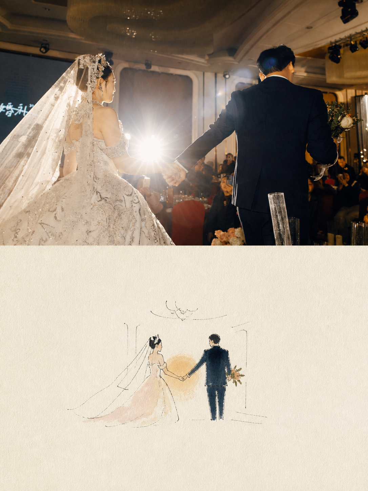
  <br><br>
  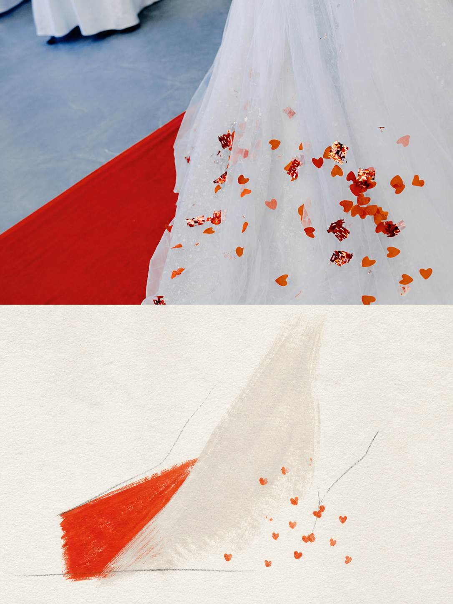
  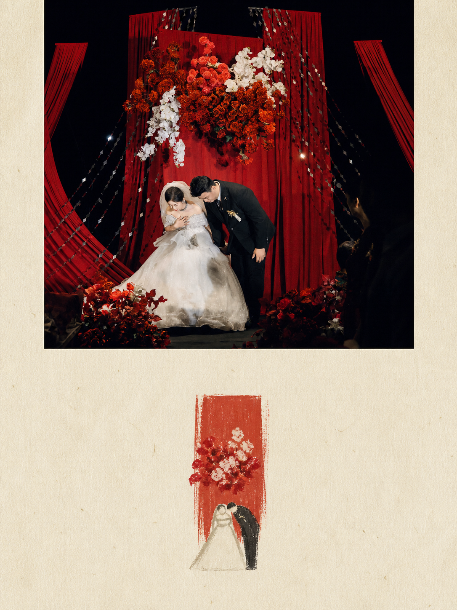
  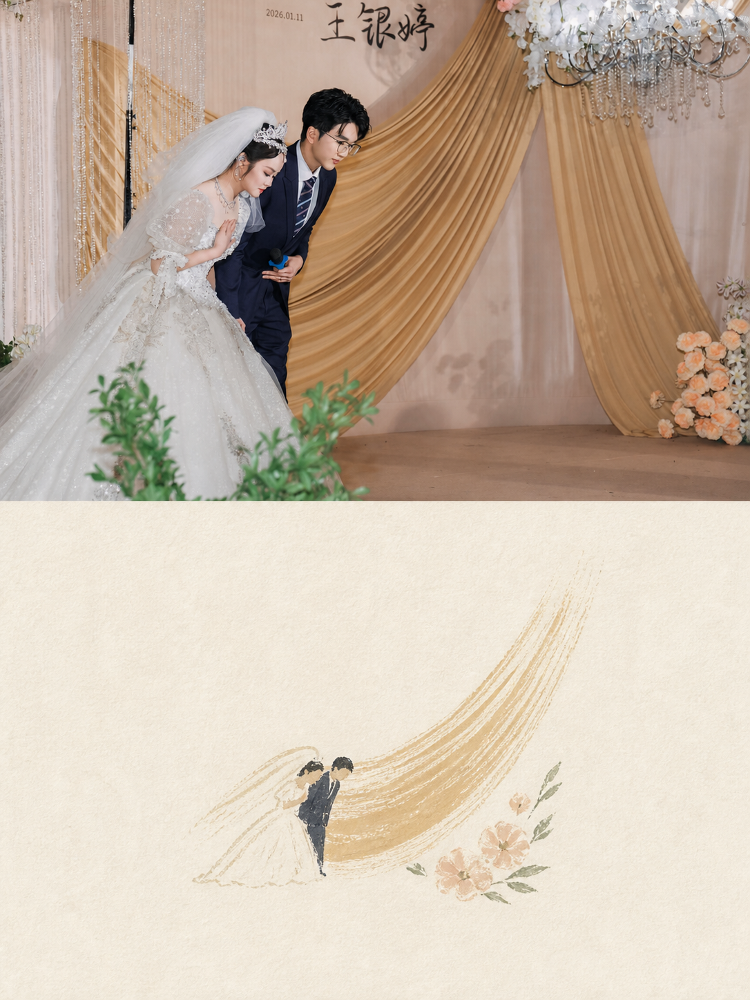
</p>

---

## 📋 目录

- [安装方法](#-安装方法)
- [使用方法](#-使用方法)
- [核心视觉规则](#-核心视觉规则)
- [可调整内容](#️-可调整内容)
- [核心原则](#-核心原则)
- [项目结构](#-项目结构)
- [隐私说明](#-隐私说明)
- [许可证](#-许可证)

---

## 📦 安装方法

### 方式一：让 Codex 安装

把下面这句话发给 Codex：

> 请从 https://github.com/juanshejun-ui/omm-photo-acrylic-diptych 安装这个 Skill。

### 方式二：手动安装

下载仓库后，将整个 `omm-photo-acrylic-diptych` 文件夹复制到 Codex 的 skills 目录，例如：

```text
~/.codex/skills/omm-photo-acrylic-diptych/
```

重新开启 Codex 对话后即可使用。

---

## 🚀 使用方法

1. 开启新的 Codex 对话。
2. 上传一张或多张希望处理的照片。
3. 输入：

> 使用 `$omm-photo-acrylic-diptych` 将这些照片分别制作成 3:4 摄影与纸本丙烯插画双分区海报。

4. 每张输入照片会分别生成一张独立作品，不会自动合并成拼图。

你也可以追加纸张色调、强调色、标题、日期、地点或留白程度等要求。

---

## 💡 核心视觉规则

| 项目 | 规则 |
| :--- | :--- |
| 📐 画布 | 严格 3:4 竖版 |
| ↕️ 分区 | 上下严格 50% / 50% |
| 📷 上半区 | 保留原始照片，不改写人物、场景、光影和空间关系 |
| 🎨 下半区 | 根据照片重新提炼，不写实复刻，不直接转线稿 |
| ◻️ 主体比例 | 插画主体约占下半区 10%–20%，保留大量留白 |
| 🖌️ 媒介 | 纤细不稳定线条、哑光丙烯色块、干刷和纸张颗粒 |
| 🌈 色彩 | 从原照片提取，不超过四种主要颜色 |
| 📝 文字 | 默认不添加；需要时保持小尺寸和疏朗排版 |

---

## 🎛️ 可调整内容

- **纸张色调**：粗糙白纸、米白纸、奶油色或浅色艺术纸
- **强调颜色**：从照片中选择更鲜明的一种颜色作为结构重点
- **插画位置**：居中、略偏左、略偏右或靠近视觉重心
- **环境暗示**：保留一条地平线、树、门、建筑弧线、花朵或光源
- **文字信息**：英文标题、地点、年份、日期、编号或一句短主题词

为了保持这套视觉语言，不建议改变 3:4 画布、50% / 50% 分区以及“小主体、大留白”的核心关系。

---

## 🧭 核心原则

1. **照片是唯一内容来源**：上半区不得被重新绘制、扩展或改写。
2. **插画必须可追溯**：下半区的重要形态、色彩和关系应来自照片中真实存在的视觉证据。
3. **提炼大于复制**：保留识别性，删除不必要的细节。
4. **留白也是内容**：不要为了填满画面而添加装饰。

---

## 📁 项目结构

```text
omm-photo-acrylic-diptych/
├── SKILL.md                     # Skill 工作流程与视觉约束
├── agents/
│   └── openai.yaml              # Codex 界面元数据
├── references/
│   └── style-spec.md            # 下半区生成规范
├── scripts/
│   └── compose_diptych.py       # 精确 3:4 与 50/50 拼接脚本
├── assets/                      # 作者完整作品示例（12 张）
├── README.md
└── LICENSE.md
```

---

## 🔒 隐私说明

作者已选择在本仓库中公开展示 12 张完整作品，未进行人物遮挡或隐私裁切。公开展示不代表授予访客复制、转载、裁剪、修改、商业使用或将作品作为训练数据的权利。

使用本 Skill 处理你自己的照片时，请确保你拥有相关照片、人物肖像及其他素材的必要权利，并在公开生成结果前取得所需许可。

---

## 📄 许可证

本项目允许个人、教育、研究和其他非商业用途。未经书面授权，不得用于商业产品、付费服务、客户项目、企业商业应用、付费课程、转售或商业化再分发。仓库中的 12 张摄影与海报示例作品版权均归 **@juanshejun-ui** 所有，并受许可证中的作品专门条款保护。

完整条款请阅读 [LICENSE.md](./LICENSE.md)。

---

<div align="center">

**如果这个项目对你有帮助，欢迎 Star ⭐ 支持！**

</div>
